# 🏗️ Pharmaceutical Research Assistant - System Architecture

**Enterprise-Grade AI Platform for Drug Discovery**  
_Version 1.0.0 | January 2025_

---

## 📋 Table of Contents

- [Overview](#overview)
- [Architecture Principles](#architecture-principles)
- [System Components](#system-components)
- [Data Flow Architecture](#data-flow-architecture)
- [Service Layer Design](#service-layer-design)
- [API Architecture](#api-architecture)
- [Data Management](#data-management)
- [Security Architecture](#security-architecture)
- [Scalability & Performance](#scalability--performance)
- [Deployment Architecture](#deployment-architecture)
- [Integration Patterns](#integration-patterns)
- [Monitoring & Observability](#monitoring--observability)

---

## 🎯 Overview

The Pharmaceutical Research Assistant is a **microservices-based AI platform** designed for accelerated drug discovery and literature analysis. The system combines multiple AI/ML services with external pharmaceutical databases to provide comprehensive research capabilities.

### Key Architectural Goals

- **🔧 Modularity**: Loosely coupled services for independent scaling
- **⚡ Performance**: Sub-second response times for critical operations
- **🛡️ Reliability**: 99.9% uptime with comprehensive error handling
- **📈 Scalability**: Horizontal scaling to support 1000+ concurrent users
- **🔒 Security**: Enterprise-grade security and data protection

---

## 🏛️ Architecture Principles

### 1. **Domain-Driven Design (DDD)**

```
Chemical Domain    Literature Domain    Research Domain
      ↓                    ↓                  ↓
ChemicalService    LiteratureService    ResearchAgent
      ↓                    ↓                  ↓
 RDKit Engine       PubMed API         Workflow Engine
```

### 2. **Service-Oriented Architecture (SOA)**

- **Separation of Concerns**: Each service handles a specific domain
- **Interface Contracts**: Well-defined APIs between services
- **Technology Agnostic**: Services can use optimal technology stacks

### 3. **Event-Driven Patterns**

- **Asynchronous Processing**: Non-blocking operations for long-running tasks
- **Reactive Systems**: Handle variable loads gracefully
- **Message Passing**: Loose coupling between components

### 4. **Clean Architecture**

```
┌─────────────────────────────────────┐
│            Presentation Layer       │ ← FastAPI Routes, OpenAPI
├─────────────────────────────────────┤
│            Application Layer        │ ← Research Agents, Workflows
├─────────────────────────────────────┤
│            Domain Layer             │ ← Business Logic, Models
├─────────────────────────────────────┤
│            Infrastructure Layer     │ ← External APIs, Databases
└─────────────────────────────────────┘
```

---

## 🔧 System Components

### **Core Services Architecture**

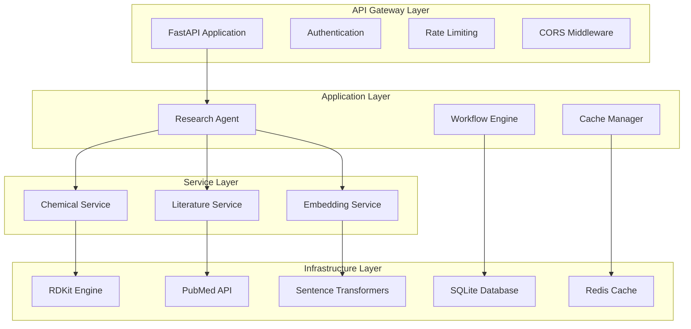

### **Component Responsibilities**

| Component               | Responsibility                                       | Technology Stack               |
| ----------------------- | ---------------------------------------------------- | ------------------------------ |
| **FastAPI Application** | HTTP API, Request routing, Validation                | FastAPI, Pydantic, Uvicorn     |
| **Research Agent**      | Workflow orchestration, Multi-service coordination   | Python, AsyncIO                |
| **Chemical Service**    | Molecular analysis, Property calculation, Similarity | RDKit, NumPy, SciPy            |
| **Literature Service**  | Paper search, Relevance scoring, Trend analysis      | Biopython, XML parsing         |
| **Embedding Service**   | Text embeddings, Semantic similarity                 | sentence-transformers, PyTorch |
| **Cache Manager**       | Response caching, Session management                 | Redis, In-memory               |
| **Database Layer**      | Data persistence, Query optimization                 | SQLite, SQLAlchemy             |

---

## 🌊 Data Flow Architecture

### **1. Request Processing Flow**

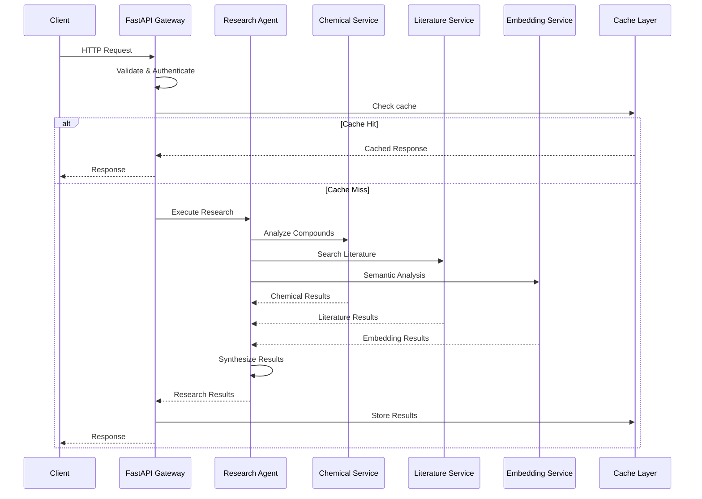

### **2. Multi-Modal Research Flow**

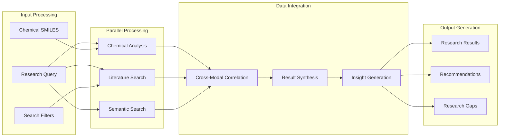

---

## 🛠️ Service Layer Design

### **Chemical Service Architecture**

```python
class ChemicalService:
    """
    Domain: Molecular chemistry and drug properties
    Responsibilities:
      - SMILES validation and parsing
      - Molecular property calculation
      - Drug-likeness assessment
      - Chemical similarity search
    """

    def __init__(self):
        self.rdkit_engine = RDKitEngine()
        self.property_calculator = PropertyCalculator()
        self.similarity_engine = SimilarityEngine()

    # Core operations with clear separation of concerns
```

#### **Chemical Service Capabilities**

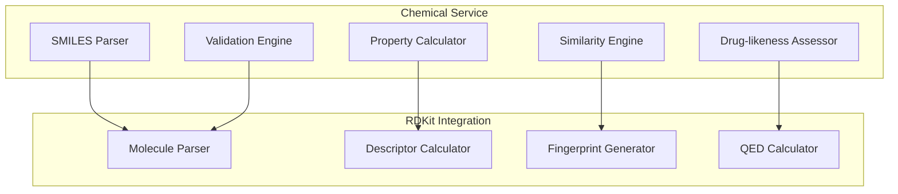

### **Literature Service Architecture**

```python
class LiteratureService:
    """
    Domain: Scientific literature and research papers
    Responsibilities:
      - PubMed search and retrieval
      - Relevance scoring and ranking
      - Trend analysis and insights
      - Research gap identification
    """

    def __init__(self):
        self.pubmed_client = PubMedClient()
        self.relevance_scorer = RelevanceScorer()
        self.trend_analyzer = TrendAnalyzer()
```

#### **Literature Processing Pipeline**

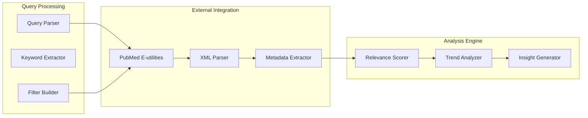

### **Embedding Service Architecture**

```python
class EmbeddingService:
    """
    Domain: Natural language processing and semantic analysis
    Responsibilities:
      - Text embedding generation
      - Semantic similarity calculation
      - Vector search and clustering
      - Cross-modal semantic analysis
    """

    def __init__(self):
        self.transformer_model = SentenceTransformer()
        self.vector_store = VectorStore()
        self.similarity_calculator = CosineSimilarity()
```

---

## 🌐 API Architecture

### **RESTful API Design**

```yaml
API Structure:
  /health:
    GET: System health and status

  /api/v1/chemical:
    /analyze:
      POST: Analyze chemical compound properties
    /similarity:
      POST: Find similar chemical compounds

  /api/v1/literature:
    /search:
      GET: Search scientific literature
    /trending:
      GET: Get trending research topics

  /api/v1/semantic:
    /similarity:
      POST: Semantic text similarity search

  /api/v1/research:
    /comprehensive:
      POST: Full multi-modal research workflow
```

### **API Response Standards**

```json
{
  "success": true,
  "message": "Operation completed successfully",
  "data": {
    // Response payload
  },
  "errors": [],
  "execution_time_ms": 245.3,
  "timestamp": "2025-01-12T10:30:00Z"
}
```

### **Error Handling Strategy**

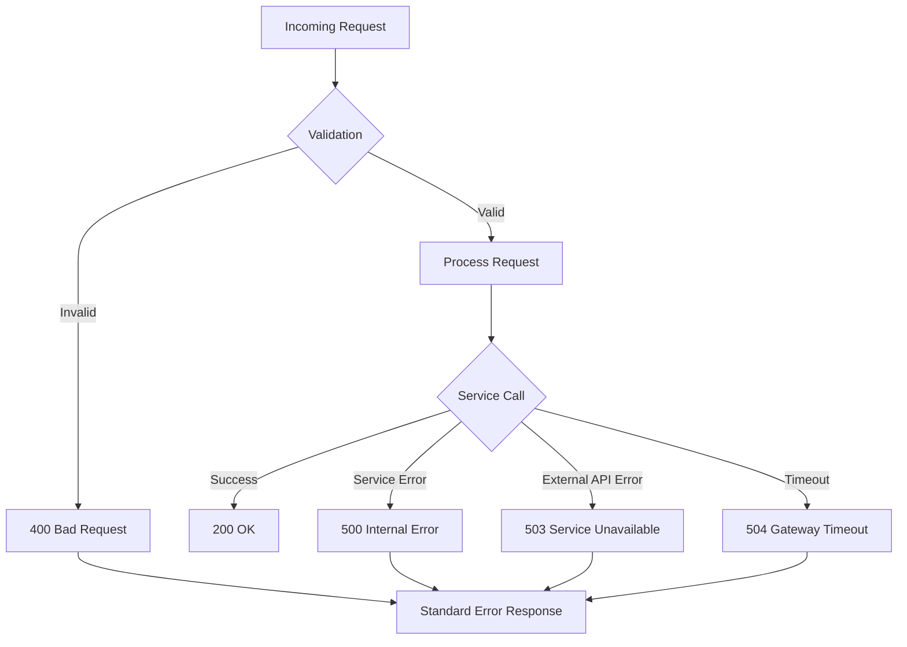

---

## 💾 Data Management

### **Data Architecture Patterns**

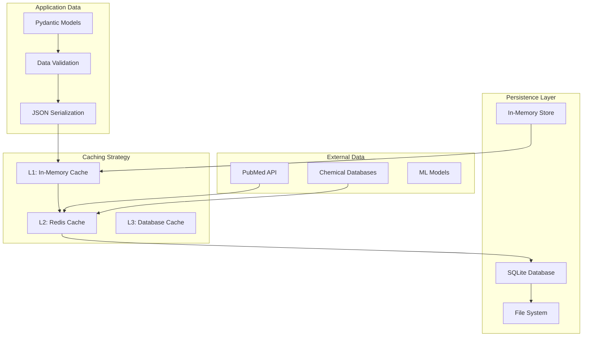

### **Data Models & Relationships**

```python
# Core domain models with clear relationships
class ChemicalCompound(BaseModel):
    id: str
    name: str
    smiles: str
    molecular_weight: Optional[float]
    drug_likeness: Optional[float]
    # ... molecular properties

class LiteraturePaper(BaseModel):
    pubmed_id: str
    title: str
    abstract: Optional[str]
    authors: List[str]
    chemical_entities: List[str]  # Links to ChemicalCompound
    # ... metadata

class ResearchResult(BaseModel):
    query_id: str
    chemical_compounds: List[ChemicalCompound]
    literature_papers: List[LiteraturePaper]
    insights: List[str]
    confidence_score: float
    # ... aggregated results
```

### **Caching Strategy**

| Cache Level          | Technology      | Purpose                     | TTL      |
| -------------------- | --------------- | --------------------------- | -------- |
| **L1 - Application** | Python dict/LRU | Hot data, embeddings        | 1 hour   |
| **L2 - Distributed** | Redis           | Session data, API responses | 24 hours |
| **L3 - Persistent**  | SQLite          | Research results, analytics | 30 days  |

---

## 🔒 Security Architecture

### **Security Layers**

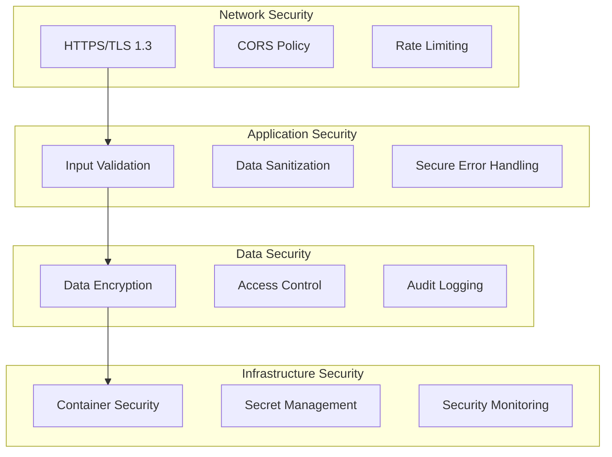

### **Security Implementation**

#### **1. Input Validation & Sanitization**

```python
# Pydantic models provide automatic validation
class ChemicalCompound(BaseModel):
    smiles: str = Field(..., regex=r'^[A-Za-z0-9@+\-\[\]()=#$:/.\\]*$')

    @validator('smiles')
    def validate_smiles_safety(cls, v):
        # Additional SMILES validation for security
        if len(v) > 1000:  # Prevent DOS attacks
            raise ValueError("SMILES too long")
        return v
```

#### **2. Rate Limiting Strategy**

```python
# API rate limiting configuration
RATE_LIMITS = {
    "/api/v1/chemical/analyze": "100/minute",
    "/api/v1/literature/search": "50/minute",
    "/api/v1/research/comprehensive": "10/minute"
}
```

#### **3. Error Handling Security**

```python
# Secure error responses that don't leak information
def secure_error_handler(request, exc):
    if isinstance(exc, ValidationError):
        return {"error": "Invalid input format"}
    else:
        # Log detailed error internally, return generic message
        logger.error(f"Internal error: {exc}")
        return {"error": "Internal server error"}
```

---

## 📈 Scalability & Performance

### **Performance Architecture**

```mermaid
graph TB
    subgraph "Load Balancing"
        LoadBalancer[Load Balancer]
        Instance1[API Instance 1]
        Instance2[API Instance 2]
        Instance3[API Instance N]
    end

    subgraph "Caching Layer"
        Redis[Redis Cluster]
        CDN[CDN (Static Assets)]
        AppCache[Application Cache]
    end

    subgraph "Database Layer"
        ReadReplicas[Read Replicas]
        WriteDB[Primary Database]
        ConnectionPool[Connection Pool]
    end

    subgraph "External Services"
        PubMedAPI[PubMed API]
        ChemicalAPIs[Chemical APIs]
        MLModels[ML Model Services]
    end

    LoadBalancer --> Instance1
    LoadBalancer --> Instance2
    LoadBalancer --> Instance3

    Instance1 --> Redis
    Instance1 --> AppCache
    Instance1 --> ConnectionPool

    ConnectionPool --> ReadReplicas
    ConnectionPool --> WriteDB
```

### **Performance Targets**

| Operation                  | Target Response Time | Throughput | Availability |
| -------------------------- | -------------------- | ---------- | ------------ |
| **Chemical Analysis**      | < 200ms              | 500 RPS    | 99.9%        |
| **Literature Search**      | < 2s                 | 100 RPS    | 99.5%        |
| **Similarity Search**      | < 500ms              | 200 RPS    | 99.9%        |
| **Comprehensive Research** | < 10s                | 50 RPS     | 99.5%        |

### **Scaling Strategies**

#### **1. Horizontal Scaling**

```yaml
# Docker Compose scaling
services:
  api:
    deploy:
      replicas: 3
      resources:
        limits:
          cpus: "1.0"
          memory: 2G
        reservations:
          cpus: "0.5"
          memory: 1G
```

#### **2. Database Optimization**

```sql
-- Optimized queries with proper indexing
CREATE INDEX idx_compounds_smiles ON chemical_compounds(smiles);
CREATE INDEX idx_papers_pubmed_id ON literature_papers(pubmed_id);
CREATE INDEX idx_research_query_text ON research_results(query_text);
```

#### **3. Caching Optimization**

```python
# Multi-level caching strategy
@cache_result(ttl=3600, cache_level="L1")  # 1 hour in-memory
@cache_result(ttl=86400, cache_level="L2")  # 24 hours in Redis
async def expensive_computation(params):
    return await compute_result(params)
```

---

## 🚀 Deployment Architecture

### **Containerization Strategy**

```dockerfile
# Multi-stage Docker build for optimization
FROM python:3.11-slim as base
# Base dependencies

FROM base as builder
# Build dependencies and wheels

FROM base as production
# Copy only production artifacts
COPY --from=builder /wheels /wheels
RUN pip install --no-cache-dir /wheels/*.whl
```

### **Container Orchestration**

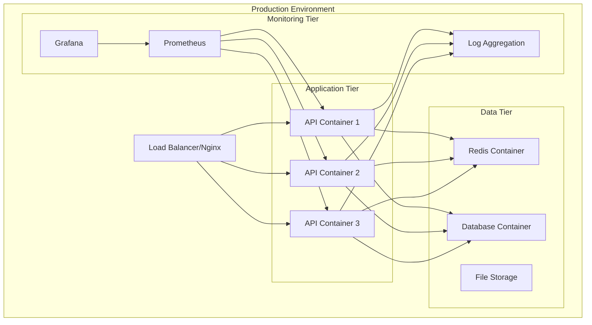

### **Environment Configuration**

```yaml
# Production docker-compose.yml
version: "3.8"
services:
  api:
    image: pharmaceutical-research:latest
    environment:
      - ENVIRONMENT=production
      - LOG_LEVEL=WARNING
      - DATABASE_URL=postgresql://user:pass@db:5432/pharma
      - REDIS_URL=redis://redis:6379/0
    deploy:
      replicas: 3
      restart_policy:
        condition: on-failure
        delay: 5s
        max_attempts: 3
    healthcheck:
      test: ["CMD", "curl", "-f", "http://localhost:8000/health"]
      interval: 30s
      timeout: 10s
      retries: 3
```

---

## 🔌 Integration Patterns

### **External API Integration**

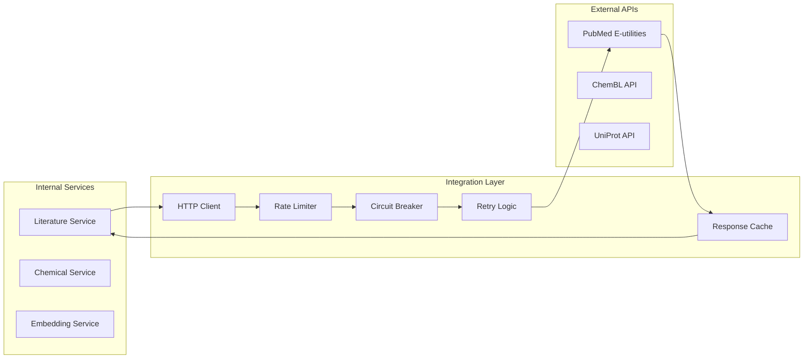

### **Circuit Breaker Pattern**

```python
class CircuitBreaker:
    """Circuit breaker for external API calls"""

    def __init__(self, failure_threshold=5, recovery_timeout=60):
        self.failure_threshold = failure_threshold
        self.recovery_timeout = recovery_timeout
        self.failure_count = 0
        self.last_failure_time = None
        self.state = "CLOSED"  # CLOSED, OPEN, HALF_OPEN

    async def call(self, func, *args, **kwargs):
        if self.state == "OPEN":
            if self._should_attempt_reset():
                self.state = "HALF_OPEN"
            else:
                raise CircuitBreakerOpenError()

        try:
            result = await func(*args, **kwargs)
            self._on_success()
            return result
        except Exception as e:
            self._on_failure()
            raise e
```

---

## 📊 Monitoring & Observability

### **Observability Stack**

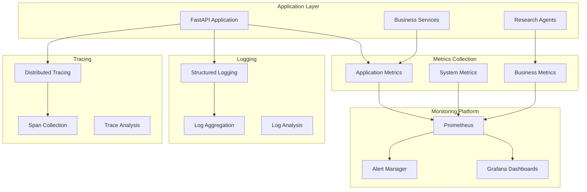

### **Key Performance Indicators (KPIs)**

#### **Technical KPIs**

- **Response Time**: P50, P95, P99 latencies
- **Throughput**: Requests per second by endpoint
- **Error Rate**: 4xx and 5xx error percentages
- **Availability**: Service uptime percentage

#### **Business KPIs**

- **Research Completion Rate**: Successful research workflows
- **User Engagement**: Active sessions and query complexity
- **Data Quality**: Chemical property accuracy, literature relevance
- **Resource Utilization**: CPU, memory, external API quotas

### **Alerting Strategy**

```yaml
# Prometheus alerting rules
groups:
  - name: pharmaceutical_research_alerts
    rules:
      - alert: HighErrorRate
        expr: rate(http_requests_total{status=~"5.."}[5m]) > 0.1
        for: 2m
        labels:
          severity: critical
        annotations:
          summary: "High error rate detected"

      - alert: SlowResponseTime
        expr: http_request_duration_seconds{quantile="0.95"} > 2
        for: 5m
        labels:
          severity: warning
        annotations:
          summary: "Slow response times detected"

      - alert: ExternalAPIFailure
        expr: external_api_success_rate < 0.95
        for: 1m
        labels:
          severity: critical
        annotations:
          summary: "External API failure rate too high"
```

---

## 🎯 Future Architecture Considerations

### **Planned Enhancements**

#### **1. LangGraph Integration**

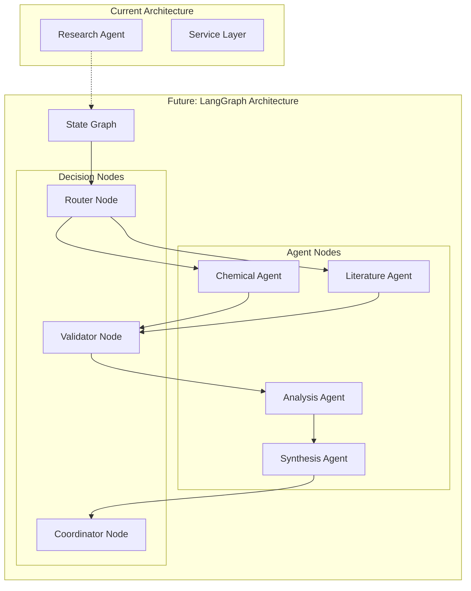

#### **2. Microservices Evolution**

- **Service Mesh**: Istio for advanced traffic management
- **Event Streaming**: Apache Kafka for real-time data processing
- **CQRS Pattern**: Command Query Responsibility Segregation
- **Event Sourcing**: Audit trail and state reconstruction

#### **3. AI/ML Pipeline Enhancement**

- **Model Serving**: TensorFlow Serving / MLflow
- **Feature Store**: Centralized feature management
- **A/B Testing**: Model performance comparison
- **AutoML**: Automated model training and deployment

---

## 📚 Technical Decisions & Rationale

### **Technology Stack Decisions**

| Decision                  | Rationale                                               | Trade-offs                                   |
| ------------------------- | ------------------------------------------------------- | -------------------------------------------- |
| **FastAPI**               | Modern async framework, automatic API docs, type safety | Learning curve for non-Python teams          |
| **RDKit**                 | Industry standard for cheminformatics                   | Large dependency, C++ compilation            |
| **SQLite**                | Zero-config, embedded, perfect for demo/development     | Not suitable for high-concurrency production |
| **Redis**                 | Fast in-memory cache, pub/sub capabilities              | Additional infrastructure complexity         |
| **sentence-transformers** | Pre-trained models, good performance                    | Model size, GPU memory requirements          |

### **Design Pattern Rationale**

#### **Repository Pattern**

```python
class ChemicalRepository:
    """Abstracts data access from business logic"""

    async def save_compound(self, compound: ChemicalCompound) -> str:
        # Database-agnostic persistence
        pass

    async def find_by_smiles(self, smiles: str) -> Optional[ChemicalCompound]:
        # Query abstraction
        pass
```

#### **Factory Pattern**

```python
class ServiceFactory:
    """Creates services with proper dependency injection"""

    @staticmethod
    def create_chemical_service() -> ChemicalService:
        return ChemicalService(
            rdkit_engine=RDKitEngine(),
            cache=CacheManager.get_instance()
        )
```

---

## 🔧 Development & Deployment Guidelines

### **Code Organization**

```
src/
├── agents/          # Research orchestration
├── services/        # Domain services
├── models/          # Data models
├── utils/           # Utilities and helpers
├── config.py        # Configuration management
└── main.py          # Application entry point

tests/
├── unit/           # Unit tests
├── integration/    # Integration tests
└── performance/    # Performance tests

docs/
├── api/            # API documentation
├── architecture/   # Architecture docs
└── deployment/     # Deployment guides
```

### **Quality Gates**

1. **Code Quality**: Black formatting, isort imports, mypy type checking
2. **Testing**: 85%+ test coverage, all tests passing
3. **Security**: Bandit security scanning, dependency checks
4. **Performance**: Sub-second response time targets
5. **Documentation**: API docs, architecture updates

---

## 📞 Contact & Contribution

**System Architect**: Petar Matov  
**Email**: pmatov@gmail.com  
**LinkedIn**: [linkedin.com/in/pmatov](https://linkedin.com/in/pmatov)

### **Architecture Review Process**

1. **RFC Creation**: Architecture Decision Records (ADRs)
2. **Peer Review**: Technical team evaluation
3. **Prototype**: Proof of concept implementation
4. **Documentation**: Update architecture docs
5. **Implementation**: Gradual rollout with monitoring

---

_This architecture document is a living document that evolves with the system. Last updated: 2025_
